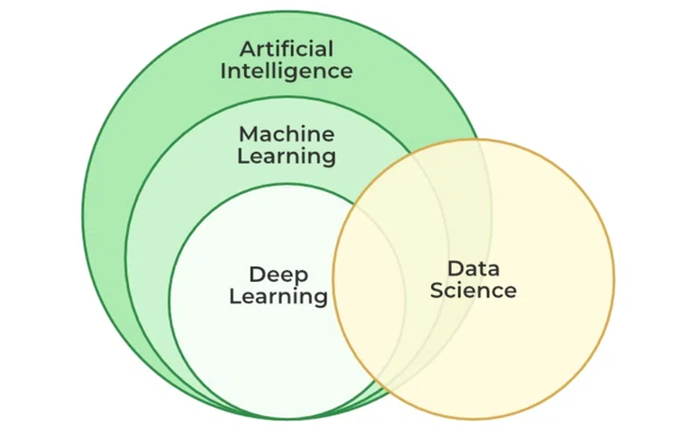
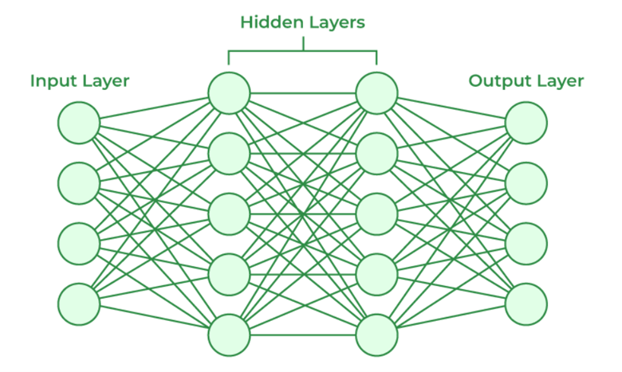

<h1>
  
  AI-Landscape-A-Bird-s-Eye-View-Reference-
</h1>
Copyright © 2026 Anes Abbas. All rights reserved.

 
 

> **Podcast Verison:** The below podcast has been generated using Google NotebookLM and may not stay true to the text. i.e. it could inculde some additions, omissions, and inaccuracies.

<audio controls>
  <source src="https://ai-landscape.netlify.app/the-ai-landscape-reference-podcast.mp3" type="audio/mpeg">

🎧 [Listen to the podcast](https://ai-landscape.netlify.app/the-ai-landscape-reference-podcast.mp3)

</audio>

## 1- Concepts and Terminology

**Artificial Intelligence (AI):** Programs that mimic intelligent behavior

**Machine Learning (ML):** AI Programs that learn from collected data 

-	Workflow: 1- Collect data. 2- Pick a model. 3- Train model to fit data
-	Output: Trained Mathematical Model
-	Usecases: Prediction, Classification, Content generation, etc.

**Deep learning (DL):** Machine learning using artificial neural networks as a model

An artificial neural network model (ANN) is a complex mathematical function made up of nested connected functions simulating neurons in a human  brain

<!--  -->

<!--  -->

**Generative Models (GM):** Trained models used to generate content (text, images, audio, etc.)
Large Language Models (LLM): Generative models that generate natural human language

-	Prompts: Instructions you give to the LLM
-	Tokens: Prompts are broken into tokens that input into and output from the model (similar to words in a sentence) 
-	AI Halucination: Whenever a model generate nonesensical and incorrect output
-	Metrics: Intelligence, latency, throughput, size, input/output tokens cost, context window 

**AI Agents:** If LLMs are like brains that can only respond to prompts, AI agents are like robots that have an LLM for a brain and tools they can use to also take actions

**Workflow automations:** Multistep processes you can create that involve Event Triggers (schedule based or some event occurrence based), Processing Steps, and Finishing Steps

-	Classical: has no AI steps, e.g. every day at 5, run a script, notify done status by email
-	AI workflow: involves AI, e.g. on every email received, summarize it using ChatGPT, send summary to WhatsApp 
-	AI agentic workflow:  involves and AI agent, e.g. on every email received, AI agent takes any actions needed, send notification to WhatsApp

## 2 - Prompting and Prompt Engineering 

**Prompts** are the instructions and input you give to an AI generative model.

 
-	Top and best
-	Score and rank
-	Include justifications
-	Compare across dimensions
-	Breakdown assess
-	Assess content and creator
-	Reference Card
-	ToC 

**Prompt engineering** is the process of crafting specific, effective instructions (prompts) to guide a generative AI model in producing desired outputs.

-	Persona, task, context, and format
-	Give References (sketches, images, urls, etc.)
-	Prompt generation 
-	Prompt reverse engineering

!!! Learn the name of things – and the concepts behind them (e.g. gardening, photogrphy, etc.)

## 3- Selected Tools Shortlist

-	General Productivity: ...
-	Expert knowledge & Creative Writing: ...
-	Deep Grounded Research: ...
-	Knowledge Synthesis: ...
-	Multimedia Assets Generation (audio, video, images): ...
-	3D Assets Generation and Animation: ...
-	Multimedia Documents Generation: ...
-	App Developement and Vibe Coding: ...
-	Workflow Automations: ...
-	Machine Learning: ...

<!-- -	General Productivity: Claude Code / Gemini CLI / OpenCode
-	Expert knowledge & Creative Writing: ChatGPT, OmniExpert
-	Deep Grounded Research: Perplexity
-	Knowledge Synthesis: NotebookLM, Eleven Reader
-	Multimedia Assets Generation (audio, video, images): Google AI studio
-	3D Assets Generation and Animation: Tripo
-	Multimedia Documents Generation: Canva Magic Suite, Gamma
-	App Developement and Vibe Coding: Google Build
-	Workflow Automations: Zapier, n8n
-	Machine Learning: AWS/Google AutoML -->

## 4- The Secret Is In You

AI tools are just tools, in the era of AI, these are the skills worth improving in:

-	Research skills
-	Critical thinking skills
-	Creative thinking skills
-	Holistic thinking skills
-	Organization skills

## 5- AI Responsible Use

-	Thou shall avoid using AI just for hype
-	Thou shall use AI for good, not personal gains
-	Thou shall be mindful of others data privacy
-	Thou shall use AI to facilitate, inspire, and guide
-	Thou shall teach others to use AI responsibly
-	Thou shall re-visit these points frequently

---

